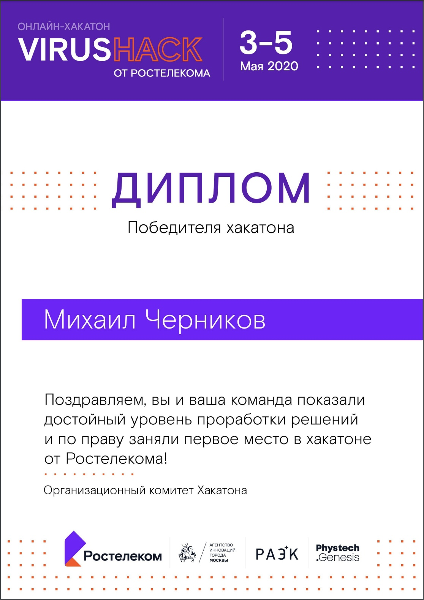

# Nurse Home Assistant

__Хакатон:__ [онлайн хакатон VirusHack от Ростелекома](https://virushack.ru)

__Трек:__ «Уход за тяжелобольными в Цифровом городе» от АСИ и фонд "Вера"

__Задача:__ необходимо разработать цифровой продукт (приложение), сервис, который помогает организовать уход за тяжелобольным человеком дома. Аудитория — близкие тяжелобольного человека и/или его сиделки. 

__Решение:__ Мобильное приложение, на основе состояния больного рекомендующее индивидуальный план ухода, и содержащее “умную” базу знаний подстраивающуюся под изменяющееся состояние пациента. 

__Результат:__ 1 место

__Команда:__ Dope Zebra EVM
- [Михаил Черников - Product Owner](https://github.com/Xoul28)
- [Евгений Мезенцев - Android Developer](https://github.com/Tduty)
- [Виталий Морозов - Android Developer](https://github.com/Doomsday46)
- Иван Уваров - Designer
- Александра Болдырева - Designer

## Демонстрационные материалы

- [Дизайн](https://www.figma.com/file/k2iPVutei1Evc46LDxgDVK/NurseHomeAssistant?node-id=0%3A1)
- [Презентация](presentation.pdf)
- [Полная информация по проекту (Питчи,Идеи и т.п.)](documents.pdf)
- [Запись презентации](https://www.youtube.com/watch?v=jjONgvJCIWk)
- [Запись демо](https://www.youtube.com/watch?v=miTcJsMn79U&feature=youtu.be)

## Диплом победителя

[Pdf вариант](diplom_chernikov.pdf)

